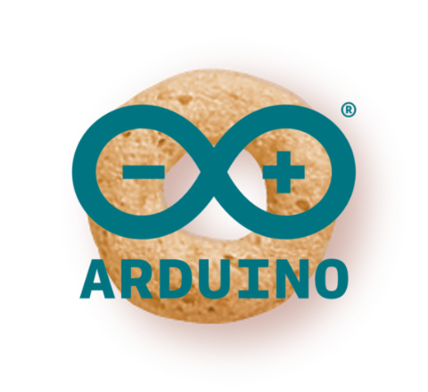
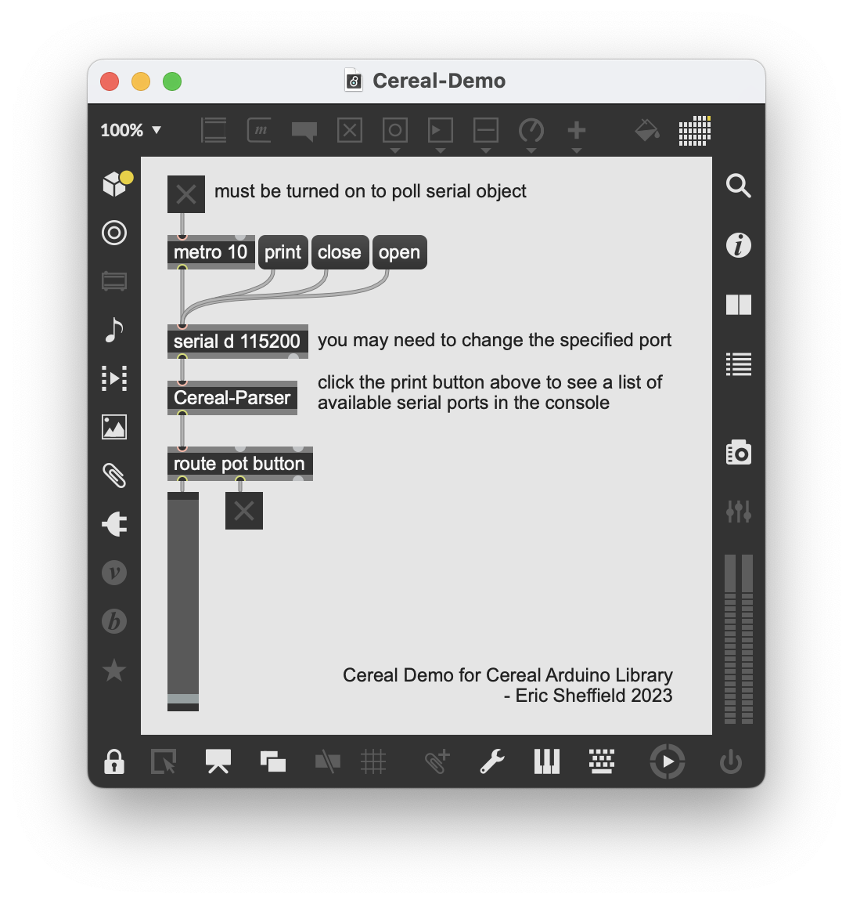
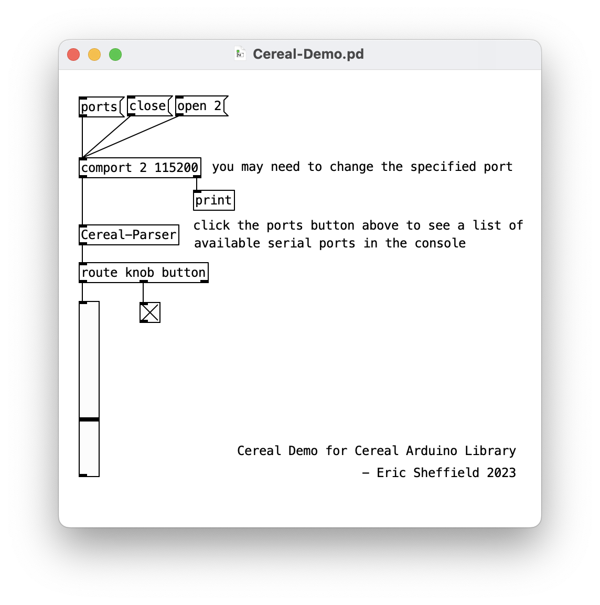

# Cereal Library

## Description
The Cereal Arduino library and accompanying Max and Pure Data (Pd) patches were created to help simplify serial communication for beginners, especially when using multiple sensors.



## Getting Started
Either download a .zip file of this repository using the green Code button above or clone to your computer using git or GitHub Desktop.

## Arduino Setup
*Open the included Cereal-Arduino sketch to see a quick demonstration of the steps listed below.*
1. Ensure that the Cereal.h, CerealAnalog.cpp, and CerealDigital.cpp files are all in the same folder as your working Arduino sketch. Alternatively, you can manually install the library [using these instructions](https://docs.arduino.cc/software/ide-v1/tutorials/installing-libraries#manual-installation).
2. Include the library at the top of your sketch.
	1. If not installed manually, use  `#include "Cereal.h"`.
	2. If installed manually, you should be able to find Cereal under Include Library in the Sketch menu.
3. In your Arduino sketch, before setup, create a CerealAnalog object for each analog input and/or a CerealDigital digital for each digital input that you will be using.
	```
	CerealAnalog name("header", pin);
	CerealDigital name("header", pin);
	```
	For example, if using a potentiometer with analog input 0, your code might look like this:
	```
	CerealAnalog pot("pot", 0);
	```
	The name and header that you choose is up to you. In most cases, they will probably be the same, but they don't have to be.
4. In your loop function, call the method `name.readWrite();` for each of your CerealAnalog and CerealDigital objects. For example, using the same potentiometer on analog input 0:
   ```
   pot.readWrite();
   ```
	This one line will both a) take a reading from the pin and b) send it via serial to your Max or Pd patch.


## Using in Max and Pd
*Open the included Cereal-Demo patch to see a quick demonstration of the steps listed below.*
1. *Pd only*: Install the comport object if needed. This object handles serial communication in Pd. It does not come bundled with the default Pd installation. You can find it by opening the Find externals window from the Help menu.
2. Ensure that the Cereal-Parser file is in the same folder as your current working patch. You can also save it elsewhere, as long as the path is set up in File Preferences (Max) or Preferences (Pd).
3. Create the Cereal-Parser object in your working patch. The inlet of this object should be connected to the outlet of the serial (Max) or comport (Pd) object.
4. If your Arduino is connected and the serial port is open, you should see the paired headers and values from your Arduino inputs coming out of the Cereal-Parser object. These can then be handled using the route object.




## A Few Notes/Caveats
- For simplicity, the Cereal library uses the INPUT_PULLUP pin mode for all digital pins. This means that a) no resistor is needed when using buttons or switches and b) the button/switch should be connected to GND instead of 5V. This also means that the logic of the reading is flipped, e.g. pushing a button creates a LOW reading at that pin. However, this reading is flipped again before being sent over serial so that the behavior is more aligned with expectations, e.g. a pushed button sends 1, a released button sends 0.
- The Arduino ADC is 10-bit (0-1023), but the serial/comport objects in Max and Pd can only deal with 8-bit values (0-255). This is handled in the Cereal library by sending each analog reading as 2 separate bytes and then recombining them within the Cereal-Parser object. This will likely be invisible to you when using the library, but it is worth mentioning so that a) you know to expect a range of values from 0-1023 in Max/Pd and b) the bit shifting object in the Cereal-Parser patch - `[<< 3]` - makes a little more sense.
- This library is designed to be simple and approachable, not efficient. Sending multiple-character headers over serial is probably using a lot more bandwidth than necessary. I do not make any claims about the performance of this library. If you find that you are using many sensors, you may have to devise your own serial solution if you start experiencing performance issues. But hey, if that's the case, than you're probably past the beginner stage for which this library is intended!